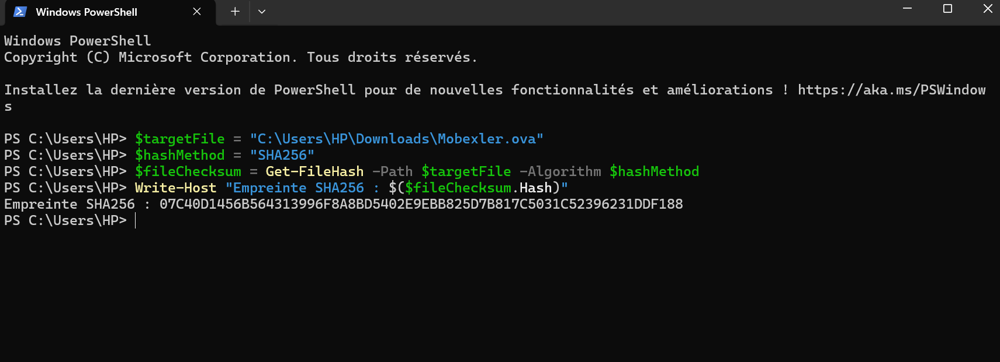

# Mobexler — Environnement de test mobile (TP1)

> Configuration d'un lab Android sécurisé avec Mobexler, VirtualBox, et ADB.

---

## Sommaire

- [Prérequis](#prérequis)
- [Étape 1 — Téléchargement & vérification](#étape-1--téléchargement--vérification)
- [Étape 2 — Import dans VirtualBox](#étape-2--import-dans-virtualbox)
- [Étape 3 — Démarrage & connexion](#étape-3--démarrage--connexion)
- [Étape 4 — Vérification réseau](#étape-4--vérification-réseau)
- [Étape 5 — Snapshot CLEAN_BASELINE_TP1](#étape-5--snapshot-clean_baseline_tp1)
- [Étape 6 — Cible Android & ADB](#étape-6--cible-android--adb)
- [Récapitulatif des éléments critiques](#récapitulatif-des-éléments-critiques)

---

## Prérequis

- Virtualisation activée dans le BIOS (VT-x ou AMD-V)
- VirtualBox ou VMware installé
- RAM ≥ 4 Go (8 Go recommandé) — Disque libre ≈ 25 Go
- ADB disponible (via Android Studio SDK Platform Tools ou intégré à Mobexler)
- Cible Android dédiée au test (ne pas utiliser un téléphone personnel)

---

## Étape 1 — Téléchargement & vérification

Télécharger l'image Mobexler (.ova) depuis le lien officiel Google Drive, puis calculer son empreinte SHA256 pour garantir l'intégrité du fichier.

**Windows (PowerShell)**

```powershell
$targetFile  = "Mobexler.ova"
$hashMethod  = "SHA256"
$fileChecksum = Get-FileHash -Path $targetFile -Algorithm $hashMethod
Write-Host "Empreinte SHA256 : $($fileChecksum.Hash)"
```

**Linux / macOS**

```bash
TARGET="Mobexler.ova"
computed_hash=$(sha256sum "$TARGET" | awk '{print $1}')
echo "Empreinte SHA256 : $computed_hash"
```

### Vérification du hash — capture d'écran



> Comparer la valeur obtenue avec l'empreinte publiée sur la page officielle. En l'absence d'empreinte de référence, conserver la valeur calculée pour traçabilité.

**Point de contrôle :** fichier `.ova` présent, taille cohérente, empreinte notée.

---

## Étape 2 — Import dans VirtualBox

1. **VirtualBox → File → Import Appliance** → sélectionner le fichier `.ova` → cliquer **Import**
2. Une fois l'import terminé, aller dans **VM → Settings → Network** :

| Carte réseau | Mode          | Rôle                                     |
|:------------:|:-------------:|:-----------------------------------------|
| Adaptateur 1 | NAT           | Accès Internet via l'hôte (updates, outils) |
| Adaptateur 2 | Host-Only     | Réseau de labo isolé pour la cible Android |

> **Si le réseau Host-Only n'apparaît pas :**  
> VirtualBox → Tools → Network Manager → Host-Only Networks → **Create**

**Point de contrôle :** 2 cartes réseau configurées (NAT + Host-Only) visibles dans les paramètres.

---

## Étape 3 — Démarrage & connexion

Démarrer la VM, puis se connecter avec les identifiants par défaut :

```
Identifiant : mobexler
Mot de passe : mobexler
```

> Si l'identifiant est refusé, essayer l'utilisateur affiché à l'écran ou consulter le README officiel du projet Mobexler.

**Point de contrôle :** accès au bureau ou au terminal obtenu.

---

## Étape 4 — Vérification réseau

Ouvrir un terminal dans Mobexler et exécuter les tests suivants :

```bash
# 1. Lister les interfaces et leurs adresses IP
ip addr show

# 2. Afficher la table de routage
ip route show

# 3. Tester la connectivité Internet
ping -c 3 8.8.8.8
ping -c 3 google.com
```


**Interprétation des résultats :**

| Symptôme | Cause probable | Action |
|:---------|:---------------|:-------|
| Ping IP OK mais DNS KO | Mauvaise configuration DNS | Éditer `/etc/resolv.conf` |
| Aucune route par défaut | NAT mal configuré | Vérifier l'adaptateur 1 dans VirtualBox |
| Les deux pings échouent | VM sans accès réseau | Redémarrer la VM après avoir reconfiguré NAT |

**Point de contrôle :** ping IP (8.8.8.8) et ping DNS (google.com) réussis.

---

## Étape 5 — Snapshot CLEAN_BASELINE_TP1

Créer ce snapshot **après** validation des étapes 1 à 4, avant toute modification du système.

**VirtualBox**

```
VM sélectionnée → onglet Snapshots → bouton Take
Nom         : CLEAN_BASELINE_TP1
Description : Import OVA OK, NAT + HostOnly OK, boot réussi, prêt pour ADB
```

**VMware**

```
VM → Snapshot → Take Snapshot
Nom         : CLEAN_BASELINE_TP1
Description : Import OVA OK, NAT + HostOnly OK, boot réussi, prêt pour ADB
```

### Démonstration — création et restauration du snapshot

https://github.com/user-attachments/snapshotdemo.mp4

> Ce snapshot est le **point de restauration de référence**. À chaque TP modifiant le système (proxy, certificats, outils supplémentaires), une restauration remet l'environnement dans un état propre et reproductible.

**Point de contrôle :** snapshot visible dans la liste. Restauration testée (recommandé).

---

## Étape 6 — Cible Android & ADB

### Option A — Smartphone de test via USB *(recommandé)*

**A1. Activer le mode développeur sur l'appareil**

```
Paramètres → À propos du téléphone → taper 7× sur "Numéro de build"
Options développeur → Débogage USB → Activé
```

**A2. Passer le périphérique USB à la VM**

```
VirtualBox : Périphériques → USB → sélectionner l'appareil
VMware     : connecter le périphérique USB à la VM
```

**A3. Vérifier la connexion ADB dans Mobexler**

```bash
adb version
adb devices
```

Résultat attendu :

```
List of devices attached
XXXXXXXXXXXXXXXX    device
```

**Dépannage :**

```bash
# Si "unauthorized" → accepter la popup RSA sur le téléphone, puis :
adb kill-server
adb start-server
adb devices
```

---

### Option B — Émulateur Genymotion

**B1.** Démarrer un device Genymotion sur l'hôte, noter son IP (réseau Host-Only).

**B2.** Connecter ADB depuis Mobexler :

```bash
DEVICE_IP="<IP_DE_VOTRE_DEVICE>"
PORT_ADB=5555
adb connect ${DEVICE_IP}:${PORT_ADB}
adb devices
```

### Démonstration — connexion ADB

https://github.com/user-attachments/adbconnect.mp4

**Point de contrôle :** le device apparaît dans `adb devices` avec le statut `device`.

---

## Récapitulatif des éléments critiques

Documenter ces valeurs pour assurer la reproductibilité du lab :

| Élément                  | Valeur à noter                              |
|:-------------------------|:--------------------------------------------|
| Hash SHA256 du fichier OVA | Calculé à l'étape 1                       |
| IP interface NAT         | Relevée via `ip addr show`                  |
| IP interface Host-Only   | Relevée via `ip addr show`                  |
| Version ADB              | Relevée via `adb version`                   |
| Nom du snapshot          | `CLEAN_BASELINE_TP1`                        |
| Cible Android            | Option A (USB) ou B (émulateur) + ID/IP     |

---
